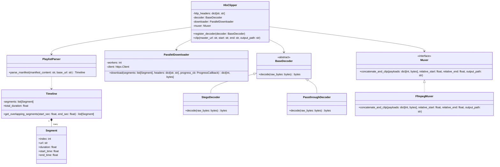
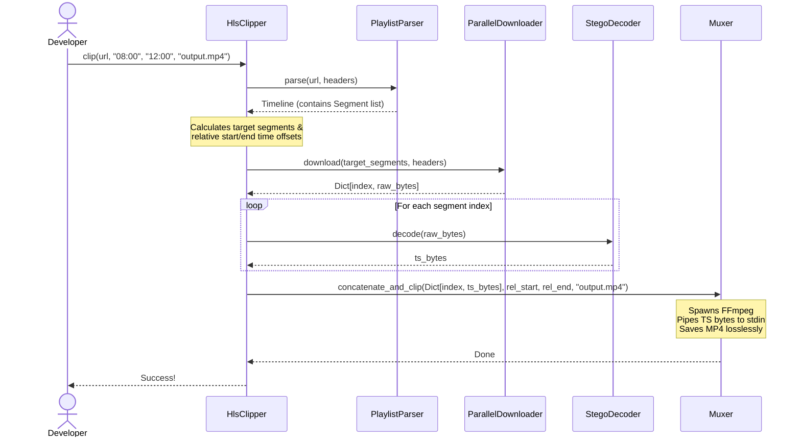

# stego-hls Technical Design Document

This document outlines the low-level object-oriented design, sequence flow, steganography extraction algorithm, and test strategy for the `stego-hls` library.

---

## 1. Class Architecture



---

## 2. Low-Level Python Specifications (Python 3.14+)

### A. Data Models & Timeline Mapping
```python
from collections.abc import Callable
from dataclasses import dataclass

type ProgressCallback = Callable[[int, int], None]
type DecodedPayloads = dict[int, bytes]


@dataclass(frozen=True, kw_only=True)
class Segment:
    index: int
    url: str
    duration: float
    start_time: float
    end_time: float


class Timeline:
    def __init__(self, segments: list[Segment], /) -> None:
        self.segments = segments
        self.total_duration = sum(seg.duration for seg in segments)

    def get_overlapping_segments(self, *, start_sec: float, end_sec: float) -> list[Segment]:
        """Returns all HLS segments that overlap with the target time range."""
        return [
            seg for seg in self.segments
            if seg.start_time < end_sec and seg.end_time > start_sec
        ]
```

### B. Extensible Decoders (Strategy Pattern)
```python
from abc import ABC, abstractmethod

class BaseDecoder(ABC):
    @abstractmethod
    def decode(self, raw_bytes: bytes, /) -> bytes:
        """Decode raw segment bytes into clean Transport Stream (.ts) payload."""
        pass


class PassthroughDecoder(BaseDecoder):
    def decode(self, raw_bytes: bytes, /) -> bytes:
        return raw_bytes


class StegoDecoder(BaseDecoder):
    MPEG_TS_PACKET_SIZE = 188
    SYNC_BYTE = 0x47

    def decode(self, raw_bytes: bytes, /) -> bytes:
        """Strips steganographic image frames and isolates the Transport Stream bytes."""
        iend_idx = raw_bytes.find(b"IEND")
        search_start = 0 if iend_idx == -1 else iend_idx + 12
        sub_data = raw_bytes[search_start:]
        
        for offset in range(len(sub_data) - self.MPEG_TS_PACKET_SIZE * 2):
            if (sub_data[offset] == self.SYNC_BYTE and 
                sub_data[offset + self.MPEG_TS_PACKET_SIZE] == self.SYNC_BYTE and 
                sub_data[offset + self.MPEG_TS_PACKET_SIZE * 2] == self.SYNC_BYTE):
                return sub_data[offset:]
                
        raise ValueError("MPEG-TS sync pattern not found in segment payload.")
```

### C. Muxer Interface & FFmpeg Implementation
```python
import subprocess
from typing import Protocol

class Muxer(Protocol):
    def concatenate_and_clip(self, 
                             payloads: DecodedPayloads, 
                             *, 
                             relative_start: float, 
                             relative_end: float, 
                             output_path: str) -> None:
        """Concatenates the payloads and trims them to output_path."""
        ...


class FfmpegMuxer(Muxer):
    def concatenate_and_clip(self, 
                             payloads: DecodedPayloads, 
                             *, 
                             relative_start: float, 
                             relative_end: float, 
                             output_path: str) -> None:
        """Pipes TS payload bytes directly into FFmpeg's stdin to output an MP4."""
        cmd = [
            "ffmpeg", "-y", 
            "-ss", f"{relative_start:.3f}", 
            "-to", f"{relative_end:.3f}", 
            "-i", "pipe:0", 
            "-c", "copy", 
            output_path
        ]
        
        with subprocess.Popen(cmd, stdin=subprocess.PIPE, stderr=subprocess.PIPE) as process:
            try:
                for index in sorted(payloads.keys()):
                    process.stdin.write(payloads[index])
                process.stdin.close()
                process.wait()
            except Exception as e:
                process.kill()
                raise RuntimeError(f"FFmpeg stream remuxing failed: {e}")
```

### D. Downloader Engine
```python
import httpx
from concurrent.futures import ThreadPoolExecutor, as_completed

class ParallelDownloader:
    def __init__(self, *, workers: int = 8, client: httpx.Client | None = None) -> None:
        self.workers = workers
        self.client = client or httpx.Client(follow_redirects=True, timeout=30.0)

    def download(self, 
                 segments: list[Segment], 
                 headers: dict[str, str], 
                 *, 
                 progress_cb: ProgressCallback | None = None) -> dict[int, bytes]:
        """Downloads segment bytes concurrently using the configured HTTP client."""
        raw_payloads: dict[int, bytes] = {}

        def fetch_segment(seg: Segment) -> tuple[int, bytes]:
            resp = self.client.get(seg.url, headers=headers)
            resp.raise_for_status()
            return seg.index, resp.content

        with ThreadPoolExecutor(max_workers=self.workers) as executor:
            futures = {executor.submit(fetch_segment, seg): seg for seg in segments}
            for future in as_completed(futures):
                idx, data = future.result()
                raw_payloads[idx] = data
                if progress_cb:
                    progress_cb(len(raw_payloads), len(segments))

        return raw_payloads
```

### E. Playlist Parser
```python
import re
import urllib.parse

class PlaylistParser:
    @staticmethod
    def parse_manifest(manifest_content: str, *, base_url: str) -> Timeline:
        """Pure parsing logic: extracts segments and durations from raw HLS string."""
        lines = [line.strip() for line in manifest_content.split("\n") if line.strip()]
        segments: list[Segment] = []
        cum_time = 0.0
        current_duration = 0.0
        
        segment_index = 0
        for line in lines:
            if line.startswith("#EXTINF:"):
                dur_match = re.match(r"#EXTINF:([0-9.]+)", line)
                if dur_match:
                    current_duration = float(dur_match.group(1))
            elif line and not line.startswith("#"):
                resolved_url = urllib.parse.urljoin(base_url, line)
                segments.append(
                    Segment(
                        index=segment_index,
                        url=resolved_url,
                        duration=current_duration,
                        start_time=cum_time,
                        end_time=cum_time + current_duration
                    )
                )
                cum_time += current_duration
                segment_index += 1
                
        return Timeline(segments)
```

### F. Clipper Facade Manager
```python
from pathlib import Path

class HlsClipper:
    def __init__(self, 
                 *, 
                 downloader: ParallelDownloader | None = None,
                 decoder: BaseDecoder | None = None,
                 muxer: Muxer | None = None) -> None:
        self.downloader = downloader or ParallelDownloader()
        self.decoder = decoder or StegoDecoder()
        self.muxer = muxer or FfmpegMuxer()

    def clip(self, 
             master_url: str, 
             *, 
             start: str, 
             end: str, 
             output_path: str | Path,
             headers: dict[str, str] | None = None) -> None:
        request_headers = headers or {}
        
        # 1. Fetch manifest raw text (Single-Request)
        with httpx.Client(headers=request_headers, follow_redirects=True) as client:
            resp = client.get(master_url)
            resp.raise_for_status()
            manifest_text = resp.text

        # 2. Parse manifest (Pure function)
        timeline = PlaylistParser.parse_manifest(manifest_text, base_url=master_url)

        # 3. Time bounds logic
        start_sec = self._parse_time(start)
        end_sec = self._parse_time(end)
        
        overlapping = timeline.get_overlapping_segments(start_sec=start_sec, end_sec=end_sec)
        if not overlapping:
            raise ValueError("No media segments found overlapping the target clipping range.")

        first_seg_start = overlapping[0].start_time
        relative_start = start_sec - first_seg_start
        relative_end = end_sec - first_seg_start

        # 4. Download segment buffers
        raw_payloads = self.downloader.download(overlapping, request_headers)

        # 5. Decode segments in memory
        decoded_payloads: DecodedPayloads = {
            index: self.decoder.decode(raw_data)
            for index, raw_data in raw_payloads.items()
        }

        # 6. Stream directly into Muxer stdin
        self.muxer.concatenate_and_clip(
            decoded_payloads, 
            relative_start=relative_start, 
            relative_end=relative_end, 
            output_path=str(output_path)
        )

    def _parse_time(self, time_str: str, /) -> float:
        parts = time_str.strip().split(':')
        match parts:
            case [s]:
                return float(s)
            case [m, s]:
                return float(m) * 60 + float(s)
            case [h, m, s]:
                return float(h) * 3600 + float(m) * 60 + float(s)
            case _:
                raise ValueError(f"Invalid timestamp format: {time_str}")
```

---

## 3. Data Flow Sequence Diagram



---

## 4. Steganography Payload Boundary Finding Algorithm

HLS segments wrap standard Transport Stream (TS) packets. Every TS packet is exactly **188 bytes** long and begins with a sync byte `0x47` (character `G` in ASCII).

In steganographic envelopes (e.g. mock `.png` or `.jpeg` files), the video data is appended after the official image data chunks. To isolate the video payload, the `StegoDecoder`:
1.  Scans the raw data for the PNG `IEND` metadata boundary.
2.  Starts a rolling window search beginning 12 bytes after the `IEND` chunk.
3.  Evaluates whether three consecutive sync bytes appear exactly 188 bytes apart:
    $$ \text{data}[P] == 0x47 \quad\land\quad \text{data}[P + 188] == 0x47 \quad\land\quad \text{data}[P + 376] == 0x47 $$
4.  Returns the byte offset $P$ as the valid start index of the raw `.ts` sequence.
