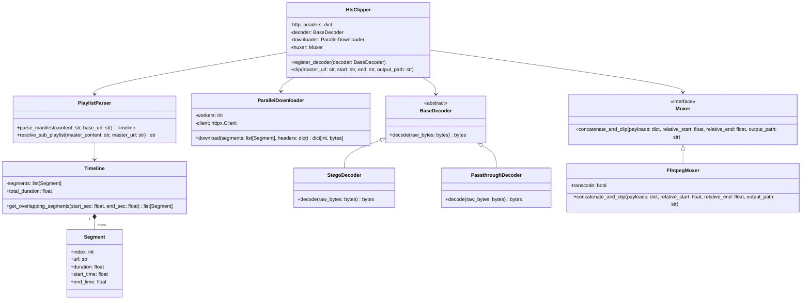
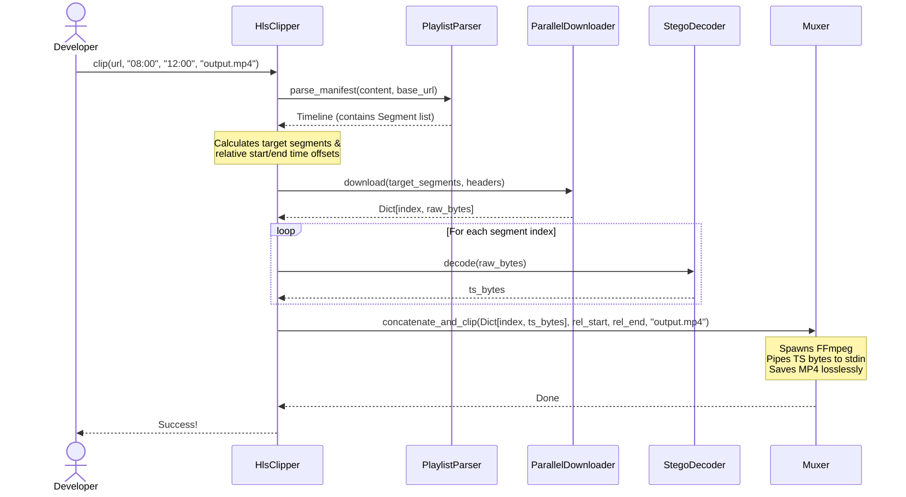

# stego-hls Technical Design Document

This document outlines the architecture, structural components, sequence flow, and steganographic extraction algorithms for the `stego-hls` library.

---

## 1. Class Architecture

The library separates responsibilities using the **Strategy Pattern** for payload decoders, the **Facade Pattern** for user coordination, and **Inversion of Control** (Dependency Injection) to keep components pure and testable.

---

## 2. Core Components

### Domain & Timeline Models
*   **`Segment`**: An immutable data model containing the HLS segment index, resolved URL, duration, and absolute timing bounds relative to the video start.
*   **`Timeline`**: A collection container for all segments in a manifest. It calculates total stream duration and computes the minimal set of segment indices that overlap with any target clipping range $[T_{start}, T_{end}]$.

### Network & Parsing Engines
*   **`PlaylistParser`**: A pure stateless parsing helper that reads manifest text content and constructs the `Timeline` mapping without making external network calls.
*   **`ParallelDownloader`**: An I/O-bound concurrency runner that uses thread pools and a configurable HTTP client to fetch raw segment chunks in parallel.

### Decoders (Strategy Pattern)
*   **`BaseDecoder`**: Abstract base class defining the signature for transforming raw downloaded bytes into valid Transport Stream (.ts) data.
*   **`PassthroughDecoder`**: Used for standard unencrypted HLS streams, returning segment bytes untouched.
*   **`StegoDecoder`**: Finds the boundary where visual image metadata ends and video packet payloads begin, parsing out valid TS sync packets.

### Stream Muxer (Piping Compiler)
*   **`Muxer`**: A protocol defining in-memory concatenation and output generation.
*   **`FfmpegMuxer`**: Feeds the concatenated in-memory byte segments directly into FFmpeg's `stdin` (`pipe:0`) and compiles the final MP4. By using system stream piping instead of intermediate files on disk, it avoids unnecessary disk I/O.

### Coordinator Facade
*   **`HlsClipper`**: The orchestrator facade that wires together the injected downloader, decoder, and muxer instances to execute a clip sequence.

---

## 3. Data Flow Sequence

---

## 4. Steganography Payload Boundary Finding Algorithm

HLS segments wrap standard Transport Stream (TS) packets. Every TS packet is exactly **188 bytes** long and begins with a sync byte `0x47` (character `G` in ASCII).

In steganographic envelopes (e.g. mock `.png` or `.jpeg` files), the video data is appended after the official image data chunks. To isolate the video payload, the `StegoDecoder` performs a boundary check:
1.  Locates the image format end metadata boundary (e.g., the PNG `IEND` chunk).
2.  Starts a rolling window search beginning immediately after this chunk.
3.  Evaluates whether three consecutive sync bytes appear exactly 188 bytes apart:
    $$ \text{data}[P] == 0x47 \quad\land\quad \text{data}[P + 188] == 0x47 \quad\land\quad \text{data}[P + 376] == 0x47 $$
4.  Identifies $P$ as the valid byte offset starting point, and returns the slice from $P$ onwards.
